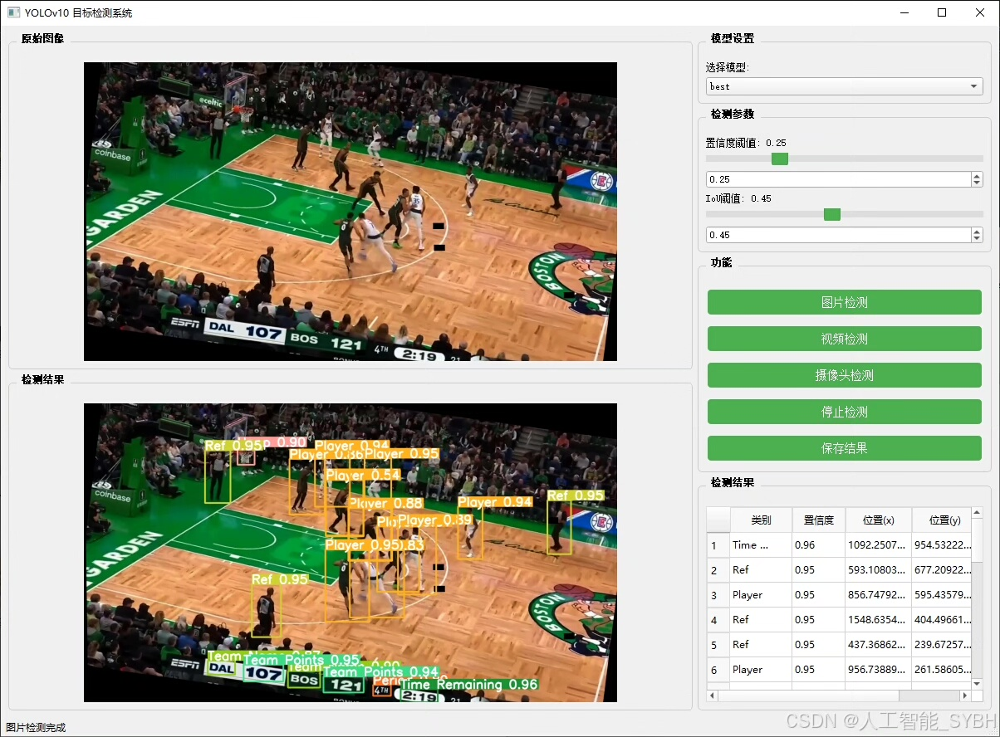
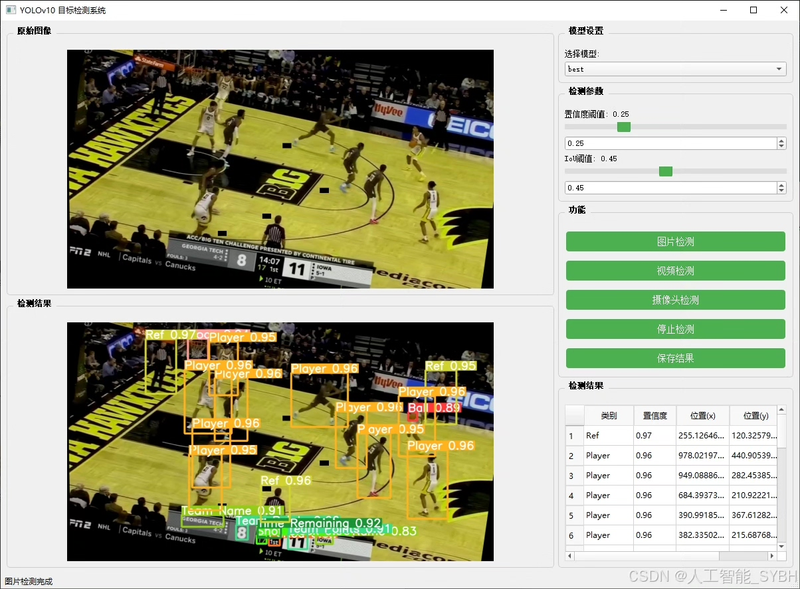
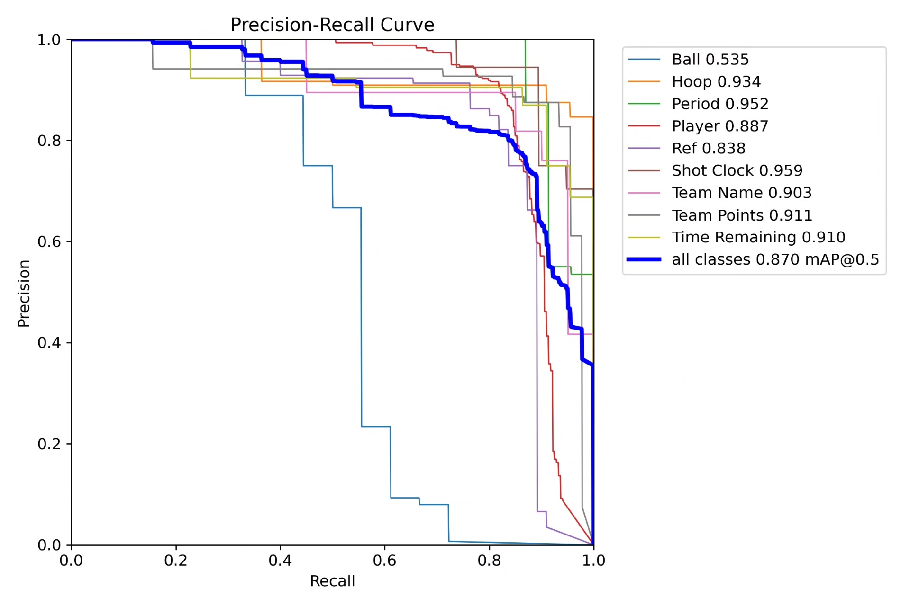
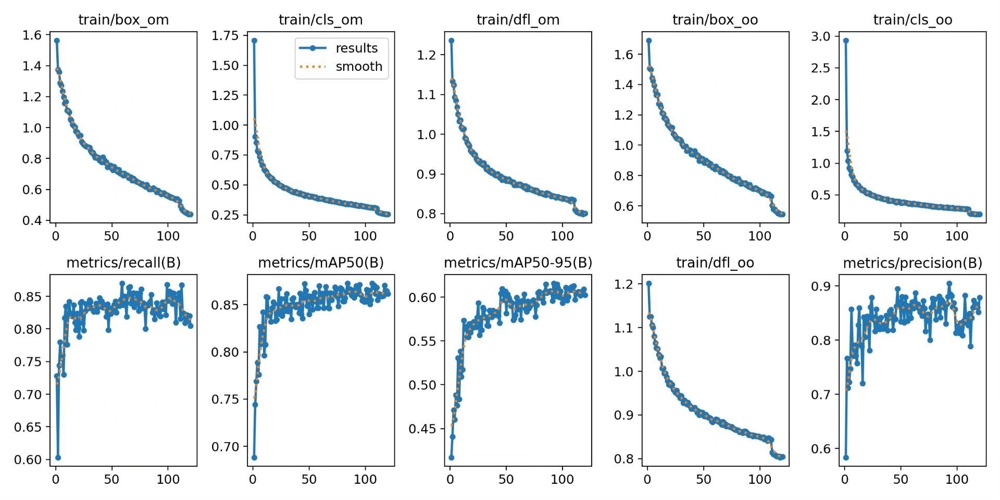
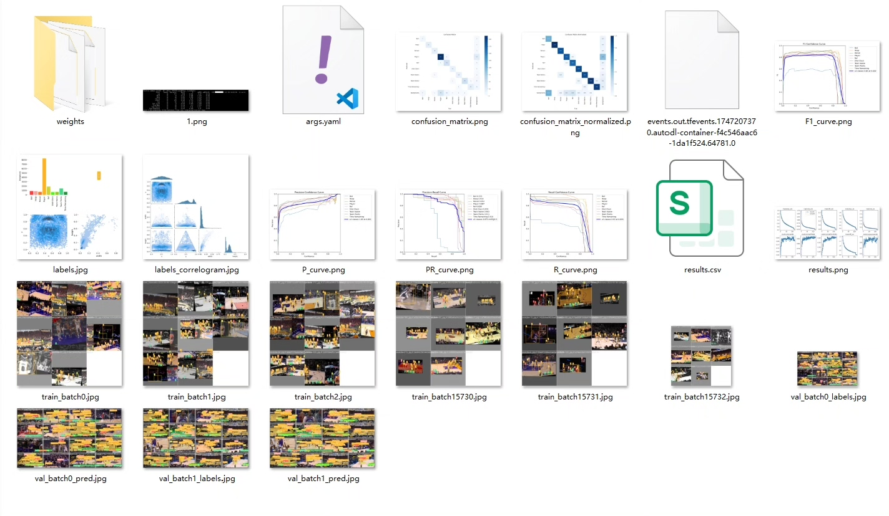
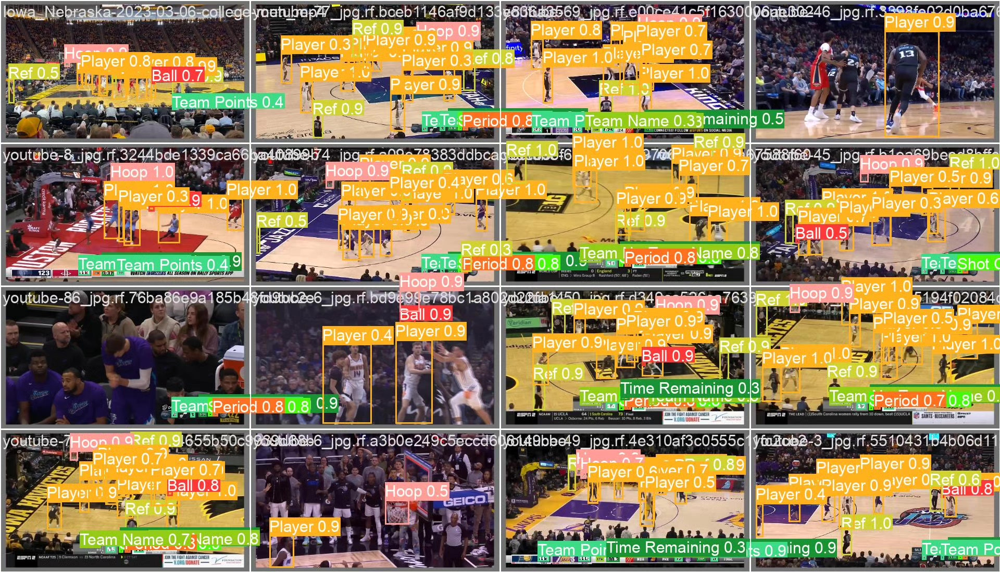
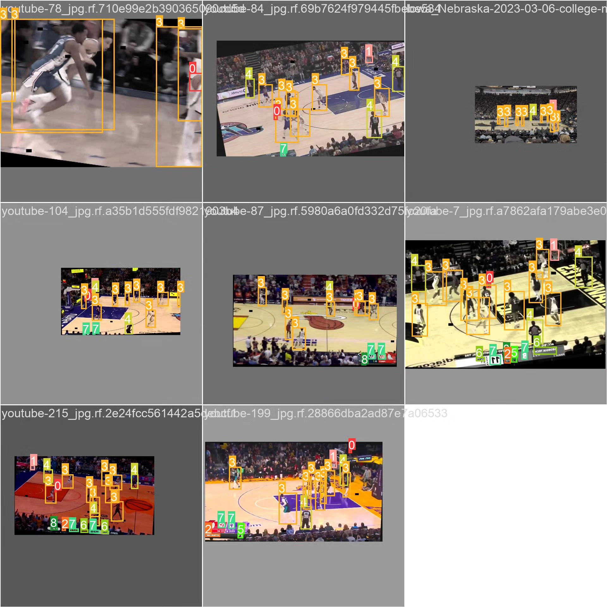

# Basketball Player Detection System Based on Deep Learning YOLOv10

## Body

Based on the YOLOv10 object detection algorithm, this project has developed a smart detection system specifically for basketball games. It can identify and classify nine key elements on the basketball court in real-time, including players, referees, basketballs, hoops, game phases, timers, team names, scores, and remaining time, etc. The system is trained and validated using a carefully constructed dataset specific to basketball games. The training set contains 1140 images, the validation set 32, and the test set 24. This detection system can provide core technical support for applications such as basketball game analysis, intelligent referee assistance, automatic match broadcasting, player performance statistics, etc. It holds significant value in sports technology applications.

The company's products have obtained the official commercial license certification of YOLO.

We offer after-sales service.

After payment, we will provide WeChat IDs for instant questions.

Environment configuration: We will provide an instructional tutorial for environment setup, and WeChat will provide answers to questions.

Remote installation services: If you need remote configuration, an additional fee of 69 is required, with all fees refunded if the configuration fails (only the installation fee is refunded for older computers).

Retraining the dataset: After setting up the environment, you can train on your own computer. If you need us to retrain, just pay 69 plus the computing power fee (2.5 yuan/hour).

Full after-sales service

## Images

## Payment

Here is a pay link on Stripe ( https://buy.stripe.com/3cs8yP7sY87d0vu9AB ). Please contact me lonlonago@foxmail.com after funding $89, and I will send you a complete data files , thank you!

